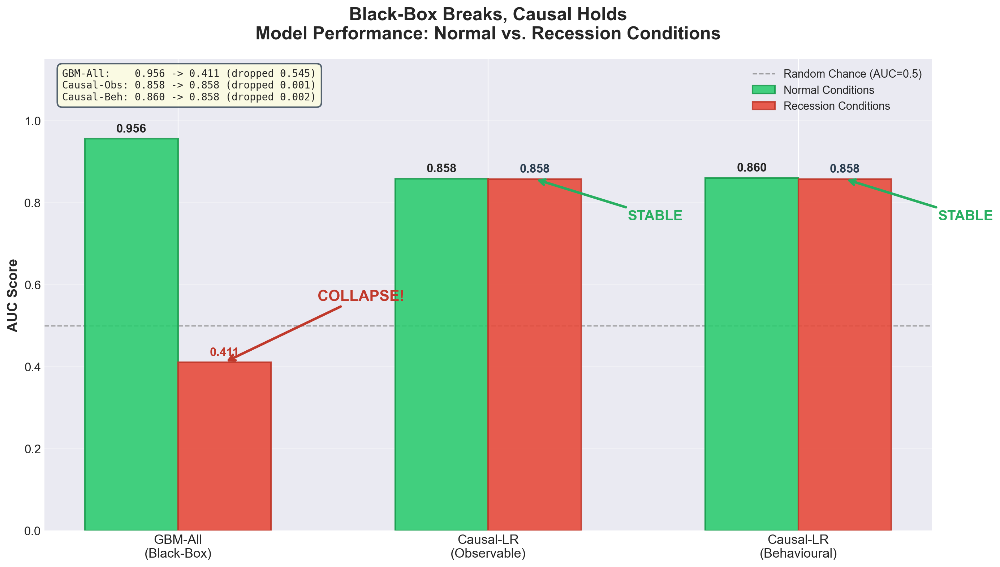

# Recession-Proof Credit Scoring

**Why Causal Models Beat Black-Box ML Under Economic Stress**

---

## The Core Thesis

Traditional ML credit scoring models achieve impressive accuracy by exploiting every pattern in the data — including **spurious correlations** that only hold during normal economic times. When a recession hits, those correlations **reverse**, causing black-box models to fail catastrophically.

A **causal model** — one using only features with genuine causal pathways to default — trades a few accuracy points in normal times for **total stability under stress**.

## Key Results

| Model | Normal AUC | Recession AUC | Status |
|-------|-----------|---------------|--------|
| GBM-All (Black-Box) | **0.956** | **0.411** | 💀 COLLAPSED |
| Causal-LR (Observable) | **0.858** | **0.858** | 🛡️ STABLE |
| Causal-LR (Behavioural) | **0.860** | **0.858** | 🛡️ STABLE |

The black-box model dropped **0.545 AUC points** — worse than a coin flip.  
The causal model dropped **0.0005 points** — virtually zero.



## Project Structure

```
causal-credit-prototype/
├── data/                     # Datasets (generated by src/scm_temporal_v1.py)
│   ├── temporal_credit_agg_train.csv    # 10,000 borrowers, 26 features
│   ├── temporal_credit_agg_test.csv     # 5,000 normal + 5,000 recession
│   ├── temporal_credit_long_train.csv   # 120,000 rows (12 months × 10k)
│   └── social_graph_edges_train.csv     # Watts-Strogatz peer graph
│
├── src/                      # Source code
│   ├── scm_temporal_v1.py    # Structural Causal Model data generator (766 lines)
│   └── run_pipeline.py       # Complete training + evaluation pipeline
│
├── notebooks/                # Jupyter notebooks
│   ├── recession_proof_credit.ipynb   # Main presentation notebook (Day 7)
│   └── mode_train_day3.ipynb          # Day 3 training notebook
│
├── models/                   # Saved model pickles (generated by pipeline)
│   ├── xgboost_model.pkl
│   ├── causal_lr_model.pkl
│   └── causal_lr_behavioural_model.pkl
│
├── reports/                  # Figures and result CSVs
│   ├── recession_test.png             # THE "WOW" CHART
│   ├── feature_importance_gbm.png     # Shows spurious features dominate GBM
│   ├── causal_lr_coefficients.png     # Coefficient CIs
│   ├── correlation_analysis.png       # Normal vs recession correlation reversal
│   ├── roc_curves_comparison.png      # ROC: Normal vs Recession
│   └── ...
│
├── tests/                    # Verification scripts
│   └── day3_verify.py
│
├── requirements.txt          # Pinned dependencies
├── .gitignore
└── README.md
```

## How It Works

### The Data (SCM Temporal v1)

A **Structural Causal Model** simulates 10,000 borrowers over 12 months with:
- **Causal features**: income stability, income volatility (CV), utility payments, debt-to-income, employment, shock exposure
- **Spurious features**: dark mode preference, social media score, app diversity, geolocation cluster, signup day, inquiry count
- **Social graph**: Watts-Strogatz small-world network with peer contagion
- **Seasonality**: Agricultural income cycles, school fee periods, holiday spending

All 6 spurious correlations **reverse sign** in the recession test set — this is what destroys the black-box model.

### The Models

| Model | Features | Strategy |
|-------|----------|----------|
| **GBM-All** (Villain) | All 22 features (including 6 spurious) | Gradient Boosted Trees |
| **Causal-LR Observable** (Hero) | 6 causal features only | Logistic Regression (L2) |
| **Causal-LR Behavioural** (Hero+) | 8 features (+ agency, consistency) | Logistic Regression (L2) |

### The Recession Shock

The test set includes 5,000 recession borrowers generated with:
- Monthly shock rate: 4% → 10%
- Shock strength: 0.30 → 0.50
- Employment penalty: +15 percentage points
- **All spurious correlations inverted**

## Quick Start

```bash
# Install dependencies
pip install -r requirements.txt

# Generate data (if not present)
python src/scm_temporal_v1.py

# Run the full pipeline (trains models, evaluates, generates charts)
python src/run_pipeline.py

# Or open the presentation notebook
jupyter notebook notebooks/recession_proof_credit.ipynb
```

## The Pitch

> *"Our competitors deploy black-box models that achieve 96% AUC in backtesting. We achieve 86%. But when the next recession hits, their models collapse to 41% — worse than a coin flip — while ours holds at 86% with zero degradation. We don't just predict risk, we understand it."*

## Dependencies

- Python 3.11+
- pandas, numpy, scikit-learn, scipy
- matplotlib, seaborn
- xgboost (optional — falls back to sklearn GBM)
- joblib

## License

MIT
