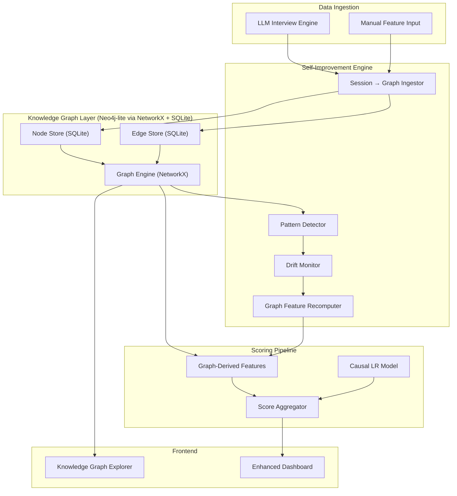

# Knowledge Graph Integration — Self-Improving Credit Scoring Engine

## Background

The current project is a **Recession-Proof Credit Scoring** system with:
- A **Structural Causal Model (SCM)** generating synthetic borrower data with causal vs spurious features
- A **Causal Logistic Regression** model (stable under recession) vs **XGBoost** (collapses)
- An **LLM-powered adaptive interview** engine (Gemini 2.5 Flash) that extracts 6 causal features through behavioral questions
- A **static knowledge graph** (`graph_data.json`) with ~20 nodes (12 borrowers, 4 employers, 2 merchants, 2 communities) loaded from flat JSON
- An **ILF (Inverse Latency Function)** scoring engine for interview reliability
- A **SQLite database** storing assessment sessions and conversation turns
- A **React + Vite frontend** with Landing, Dashboard, Assessment flow, and Results pages

### Current Limitations
1. **Static graph** — The knowledge graph is a flat JSON file with ~20 pre-defined nodes. No dynamic growth.
2. **No LLM data integration** — Completed LLM interviews are stored in SQLite but never feed back into the graph or scoring model.
3. **No self-improvement loop** — The only "self-improving" feature is a +2/+5 RUD (Repayment Under Duress) bonus. No actual model retraining or threshold drift from accumulated data.
4. **Disconnected data silos** — Assessment sessions, graph data, causal features, and scoring outcomes live in separate systems with no unifying layer.

---

## Proposed Architecture



---

## User Review Required

> [!IMPORTANT]
> **Graph Database Choice**: I'm proposing to keep using **NetworkX + SQLite** rather than introducing Neo4j or a dedicated graph database. This keeps the project zero-dependency (no new database server to install) while still providing real graph computation (PageRank, community detection, shortest paths). The trade-off is that it won't scale to millions of nodes. For a prototype/demo, this is the right choice. Do you agree?

> [!IMPORTANT]
> **Scope of Redesign**: The existing frontend aesthetic (CRED-inspired dark theme) and the core scoring pipeline (Causal LR vs XGBoost) are solid. I propose to **enhance rather than rebuild**:
> - Keep the existing 6 frontend pages and their styling
> - Add 1 new page: **Knowledge Graph Explorer** (interactive visualization)
> - Enhance the Dashboard with graph analytics
> - Completely rewrite the backend graph layer to be dynamic rather than static

---

## Open Questions

> [!WARNING]
> **Graph Visualization Library**: For the interactive Knowledge Graph Explorer in the frontend, I'd use a force-directed graph rendered with **D3.js** (via `react-force-graph-2d`). This gives us draggable nodes, zoom/pan, and animated edges. Alternatively, I could use a simpler SVG-based approach. Preference?

---

## Proposed Changes

### 1. Backend — Knowledge Graph Engine

This is the core of the change. Replace the static JSON-based graph with a dynamic, SQLite-persisted graph that grows with every completed assessment.

---

#### [NEW] [knowledge_graph.py](file:///c:/Users/panka/OneDrive/Desktop/credit_SCORE/src/knowledge_graph.py)

The central Knowledge Graph engine. Responsibilities:

- **Node management**: CRUD for typed nodes (Borrower, Employer, Community, Merchant, Skill, IncomeSource, LoanProduct)
- **Edge management**: Typed, weighted, timestamped edges (`works_at`, `lives_in`, `referred_by`, `assessed_as`, `similar_to`, `co_community`, `has_income_source`)
- **Graph computation**: Leverages NetworkX for:
  - Per-borrower degree centrality, betweenness centrality
  - Community detection (Louvain)
  - Default contagion risk (% of neighbors who defaulted)
  - Employer risk aggregation (avg default rate of co-workers)
  - Similarity edges (borrowers with similar LLM-extracted profiles)
- **Persistence**: All nodes/edges stored in SQLite tables (`kg_nodes`, `kg_edges`) for durability
- **Warm-up**: On startup, loads all nodes/edges into a NetworkX graph in-memory for fast traversal
- **Dynamic growth**: Every finalized LLM session automatically creates/updates nodes and edges

Key new node types:
```
Borrower   → name, features, score, decision, risk_tier, created_at
Employer   → name, sector, avg_default_rate (auto-computed)
Community  → name, avg_repayment_rate (auto-computed)
IncomeSource → type (salaried/freelance/agriculture/business), stability
Assessment → session_id, score, decision, confidence, timestamp
```

Key new edge types:
```
assessed_on   → Borrower → Assessment (timestamped)
similar_to    → Borrower → Borrower (cosine similarity > 0.85 on features)
influences    → Borrower → Borrower (peer network from community)
income_from   → Borrower → IncomeSource
scored_by     → Assessment → Model (causal_lr / xgboost)
```

---

#### [MODIFY] [database.py](file:///c:/Users/panka/OneDrive/Desktop/credit_SCORE/src/database.py)

Add two new tables to `init_db()`:

```sql
CREATE TABLE IF NOT EXISTS kg_nodes (
    id TEXT PRIMARY KEY,
    type TEXT NOT NULL,
    name TEXT,
    properties TEXT,  -- JSON blob for flexible attributes
    created_at TIMESTAMP DEFAULT CURRENT_TIMESTAMP,
    updated_at TIMESTAMP DEFAULT CURRENT_TIMESTAMP
);

CREATE TABLE IF NOT EXISTS kg_edges (
    id INTEGER PRIMARY KEY AUTOINCREMENT,
    source_id TEXT NOT NULL,
    target_id TEXT NOT NULL,
    type TEXT NOT NULL,
    weight REAL DEFAULT 1.0,
    properties TEXT,  -- JSON blob
    created_at TIMESTAMP DEFAULT CURRENT_TIMESTAMP,
    FOREIGN KEY (source_id) REFERENCES kg_nodes(id),
    FOREIGN KEY (target_id) REFERENCES kg_nodes(id)
);

CREATE INDEX IF NOT EXISTS idx_kg_edges_source ON kg_edges(source_id);
CREATE INDEX IF NOT EXISTS idx_kg_edges_target ON kg_edges(target_id);
CREATE INDEX IF NOT EXISTS idx_kg_edges_type ON kg_edges(type);
CREATE INDEX IF NOT EXISTS idx_kg_nodes_type ON kg_nodes(type);
```

Add CRUD functions:
- `upsert_kg_node(id, type, name, properties)` — insert or update
- `upsert_kg_edge(source, target, type, weight, properties)` — insert or update
- `get_kg_nodes(type=None)` → list
- `get_kg_edges(source=None, target=None, type=None)` → list
- `get_kg_stats()` → dict with counts

---

#### [NEW] [graph_ingestor.py](file:///c:/Users/panka/OneDrive/Desktop/credit_SCORE/src/graph_ingestor.py)

Automatic bridge between LLM sessions and the knowledge graph:

1. **`ingest_completed_session(session_data)`**: Called after every `finalize_session()`:
   - Creates/updates a `borrower` node with extracted features and score
   - Creates an `assessment` node for the session
   - Parses `bank_context` to extract employer/community mentions (keyword matching + optional LLM extraction)
   - Creates `works_at`, `lives_in` edges if employer/community detected
   - Computes `similar_to` edges by comparing feature vectors with existing borrowers (cosine similarity)
   - Creates `income_from` edge based on `employment_status` and `income_mean` patterns

2. **`compute_similarity_edges()`**: Batch job to find borrower pairs with similar profiles. Uses the 6 causal features as a feature vector, computes pairwise cosine similarity, creates edges for pairs above threshold.

3. **`recompute_community_stats()`**: Aggregates borrower outcomes by community and employer to update `avg_repayment_rate` and `avg_default_rate` dynamically.

---

#### [MODIFY] [main.py (API)](file:///c:/Users/panka/OneDrive/Desktop/credit_SCORE/api/main.py)

Changes:

1. **Import and init** the new `KnowledgeGraph` engine at startup
2. **Auto-ingest** after `finalize_session()` calls — wire `ingest_completed_session()` into the submit-answer flow
3. **New endpoints**:
   - `GET /kg/stats` — Graph statistics (node/edge counts by type, avg degree, density)
   - `GET /kg/nodes?type=borrower` — List nodes with optional type filter
   - `GET /kg/node/{node_id}` — Full node detail with all edges
   - `GET /kg/graph` — Full graph data for frontend visualization (nodes + edges)
   - `GET /kg/borrower/{borrower_id}/neighbors` — 1-hop neighborhood
   - `GET /kg/insights` — Self-improving insights (drift detection, pattern summaries)
   - `POST /kg/seed` — Seed the graph from existing `graph_data.json` + completed sessions in DB
4. **Enhance `/score`** endpoint to pull graph features from the dynamic KG instead of static `graph_contexts.json`

---

#### [MODIFY] [graph_utils.py](file:///c:/Users/panka/OneDrive/Desktop/credit_SCORE/api/graph_utils.py)

Refactor to act as a thin adapter:
- Keep existing functions for backward compatibility
- Add `get_dynamic_graph_context(borrower_node_id, kg)` that queries the live KG
- Deprecate `load_graph()` / `load_graph_contexts()` in favor of the KG engine

---

### 2. Self-Improvement Engine

---

#### [NEW] [self_improver.py](file:///c:/Users/panka/OneDrive/Desktop/credit_SCORE/src/self_improver.py)

The "brain" that learns from accumulated data:

1. **Pattern Detection**:
   - Track feature distributions across all assessed borrowers
   - Detect when a community's default rate drifts (e.g., Greenfield District goes from 8% → 15%)
   - Identify clusters of similar borrowers with different outcomes (potential new causal features)

2. **Threshold Drift**:
   - When enough assessments accumulate (configurable batch size, e.g., 50), automatically:
     - Recompute employer default rates from actual outcomes
     - Update community repayment rates
     - Suggest threshold adjustments (write to `thresholds.json`)
   - Generate an "improvement report" available via API

3. **Insight Generation**:
   - "Borrowers from AgriCo East Africa have 15% higher default rate than TechCorp India"
   - "New borrowers referred by existing low-risk borrowers default 40% less"
   - "Income volatility (income_cv) is the strongest predictor — borrowers above 0.6 default at 3× the base rate"

---

### 3. Frontend — Knowledge Graph Explorer

---

#### [NEW] [KnowledgeGraph.jsx](file:///c:/Users/panka/OneDrive/Desktop/credit_SCORE/frontend/src/components/KnowledgeGraph.jsx)

A full-page interactive graph visualization:

- **Force-directed graph** using `react-force-graph-2d`:
  - Borrower nodes colored by risk tier (green/amber/red)
  - Employer nodes as blue squares
  - Community nodes as purple hexagons
  - Edge types distinguished by color/style (dashed for `similar_to`, solid for `works_at`)
  - Node size proportional to degree centrality
  - Hover tooltips showing node details (name, score, features)
  - Click to select a node and see its full neighborhood panel

- **Side panel** when a node is selected:
  - Node properties (borrower features, employer stats)
  - Connected nodes list
  - If borrower: assessment history, score trajectory, graph risk adjustment breakdown

- **Stats bar** at top:
  - Total nodes/edges
  - Borrower count
  - Avg community repayment rate
  - Graph density
  - Number of connected components

- **Filter controls**:
  - Filter by node type
  - Filter by risk tier
  - Show/hide edge types
  - Search by name

---

#### [MODIFY] [App.jsx](file:///c:/Users/panka/OneDrive/Desktop/credit_SCORE/frontend/src/App.jsx)

Add route: `<Route path="/knowledge-graph" element={<KnowledgeGraph />} />`

---

#### [MODIFY] [Dashboard.jsx](file:///c:/Users/panka/OneDrive/Desktop/credit_SCORE/frontend/src/components/Dashboard.jsx)

Add a new section: **Knowledge Graph Insights**
- Mini graph preview (subset of top 20 nodes)
- Key metrics from `/kg/stats`
- Self-improvement insights from `/kg/insights`
- Link to full `/knowledge-graph` page

---

#### [MODIFY] [Landing.jsx](file:///c:/Users/panka/OneDrive/Desktop/credit_SCORE/frontend/src/components/Landing.jsx)

Add navigation link to the Knowledge Graph Explorer in the nav bar.

---

### 4. Dependencies

---

#### [MODIFY] [requirements.txt](file:///c:/Users/panka/OneDrive/Desktop/credit_SCORE/requirements.txt)

Add:
```
python-dotenv
```
(NetworkX is already a dependency. No other new Python packages needed.)

---

#### [MODIFY] [package.json](file:///c:/Users/panka/OneDrive/Desktop/credit_SCORE/frontend/package.json)

Add:
```json
"react-force-graph-2d": "^1.x"
```

---

### 5. Data Migration

---

#### [NEW] [seed_knowledge_graph.py](file:///c:/Users/panka/OneDrive/Desktop/credit_SCORE/src/seed_knowledge_graph.py)

One-time migration script:
1. Reads existing `graph_data.json` and creates corresponding rows in `kg_nodes` and `kg_edges`
2. Reads all completed sessions from `assessment_sessions` and ingests them into the KG
3. Computes initial similarity edges
4. Prints summary stats

---

## File Summary

| Action | File | Purpose |
|--------|------|---------|
| NEW | `src/knowledge_graph.py` | Core KG engine (nodes, edges, NetworkX computation) |
| NEW | `src/graph_ingestor.py` | Auto-ingestion from LLM sessions into KG |
| NEW | `src/self_improver.py` | Pattern detection, drift monitoring, insights |
| NEW | `src/seed_knowledge_graph.py` | Data migration script |
| NEW | `frontend/src/components/KnowledgeGraph.jsx` | Interactive graph explorer page |
| MODIFY | `src/database.py` | Add `kg_nodes`, `kg_edges` tables |
| MODIFY | `api/main.py` | New KG endpoints, auto-ingest wiring |
| MODIFY | `api/graph_utils.py` | Adapter to use dynamic KG |
| MODIFY | `frontend/src/App.jsx` | Add KG route |
| MODIFY | `frontend/src/components/Dashboard.jsx` | KG insights section |
| MODIFY | `frontend/src/components/Landing.jsx` | KG nav link |
| MODIFY | `requirements.txt` | Add python-dotenv |
| MODIFY | `frontend/package.json` | Add react-force-graph-2d |

---

## Verification Plan

### Automated Tests
1. Run `python src/seed_knowledge_graph.py` — verify nodes/edges created in SQLite
2. Run `python -c "from src.knowledge_graph import KnowledgeGraph; kg = KnowledgeGraph(); print(kg.get_stats())"` — verify engine loads
3. Start API: `uvicorn api.main:app --reload` — verify `/health`, `/kg/stats`, `/kg/graph` return valid responses
4. Complete a full LLM assessment flow → verify new nodes appear in `/kg/graph`
5. Frontend: navigate to `/knowledge-graph` → verify force-directed graph renders with nodes and edges

### Manual Verification
- Run a few LLM assessments end-to-end
- Verify graph grows with each assessment
- Check that similar borrowers are linked
- Dashboard shows updated KG stats and insights
